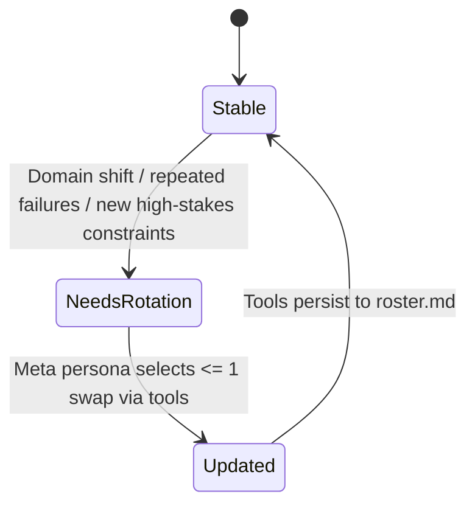

# Persistent Multi-Perspective Roster Protocol

## Overview

A first-principles thinking protocol that **creates and maintains** a durable set of internal expert personas (“the Roster”) across the conversation, persisted in \`.agents/roster.md\`.

**Core principle:** Decompose → Consult roster → Red-team check → Synthesis → Final Answer + Decision Trace.

**Announce at start:** “I’m using the persistent-multiperspective-roster-protocol skill.”

---

## The Process

### Step 1: Ensure Roster Storage Exists

**The roster must live at:** `.agents/roster.md`

If missing:
- Call `ensureRosterInitialized()` to guarantee the roster exists and is loaded (creating `.agents/roster.md` if missing).

**Rules:**
- The roster file is the **single source of truth** for personas, mandates, and ledger state.
- Use dedicated roster tools to abstract away file I/O and ensure data integrity.
- You do **not** need to manually read/write the Markdown file.
- You **must call tools** whenever you might **update** personas, ledger entries, tensions, or rotation history.

---

### Step 2: Create Roster File (if missing)

Create \`.agents/roster.md\` with **exactly** this structure:

\`\`\`markdown
# Persona Roster (Persistent)

## Meta Persona
- **Name:** Roster Steward
- **Mandate:** Govern roster stability, decide when to rotate personas, and enforce protocol quality gates.
- **Rotation Rules:** Max 1 swap per user turn; default is stability; rotate on domain shift or repeated failure modes.
- **Checks:** Calibration (atomic/compound/systemic), utilization (no theater), decision trace required, red-team required when warranted.

## Active Personas (4–7 total including Meta)

### 1) [Persona Name]
- **Role:** (highly specific to the conversation domain)
- **Mandate:**
- **Trust Model:**
- **Key Questions:**
  - Q1
  - Q2
  - Q3
- **Always-Flags:**
  - Risk A
  - Risk B
- **Blind Spots:**
- **Ledger:**
  - **Current stance:**
  - **Warnings:**
  - **Open questions:**
  - **Last updated:** (date or turn label)

### 2) Red Team / Adversary
- **Role:**
- **Mandate:**
- **Trust Model:**
- **Key Questions:**
  - Q1
  - Q2
  - Q3
- **Always-Flags:**
  - Risk A
  - Risk B
- **Blind Spots:**
- **Ledger:**
  - **Current stance:**
  - **Warnings:**
  - **Open questions:**
  - **Last updated:** (date or turn label)

### 3) Unintended Consequences
- **Role:**
- **Mandate:**
- **Trust Model:**
- **Key Questions:**
  - Q1
  - Q2
  - Q3
- **Always-Flags:**
  - Risk A
  - Risk B
- **Blind Spots:**
- **Ledger:**
  - **Current stance:**
  - **Warnings:**
  - **Open questions:**
  - **Last updated:** (date or turn label)

### 4) Practical Implementer
- **Role:**
- **Mandate:**
- **Trust Model:**
- **Key Questions:**
  - Q1
  - Q2
  - Q3
- **Always-Flags:**
  - Risk A
  - Risk B
- **Blind Spots:**
- **Ledger:**
  - **Current stance:**
  - **Warnings:**
  - **Open questions:**
  - **Last updated:** (date or turn label)

## Rotation History
- (date or turn label) change made, why, what replaced

## Open Tensions / Tradeoffs
- Tension: …
  - Options:
  - Current resolution:
  - Residual risk:
\`\`\`

---

### Step 3: Meta Persona Gate (Every Turn)

At the beginning of each user turn, the **Meta Persona** must decide:

1. **Task scope:** atomic / compound / systemic  
2. **Whether roster updates might be needed** (domain shift, new risks, repeated failures, user-requested angle)

**If updates might be needed:**
- Call `getRoster()` to retrieve the current structured roster state.
- Decide on changes based on the structured data.
- Apply changes via `addPersona()`, `removePersona()`, `updatePersona()`, `updateLedger()`, `appendRotationHistory()`, or `upsertTension()`.

**If not:**
- Proceed with the current roster state.

---

### Step 4: First-Principles Decomposition

Before proposing solutions:

1. Strip assumptions  
2. Identify actual problem (outcome)  
3. Map constraints (hard/soft/unknown)  
4. Define success (verifiable)

Keep this brief unless the user requests a deep dive.

---

### Step 5: Persona Consultation (Avoid “Perspective Theater”)

**Minimum participation:**
- Non-atomic tasks: at least **3 personas** contribute meaningful input
- Red Team must attempt failure cases when stakes/complexity warrant it

Persona output should be **compact advisor notes**, not roleplay.

---

### Step 6: Synthesis & Tension Resolution

After persona notes:

1. Agreements (shared conclusions)  
2. Tensions (tradeoffs/conflicts)  
3. Resolution (choose and justify, or mark “open tradeoff”)  
4. Action plan (steps that reflect the synthesis)

---

### Step 7: Enforcement Hooks (Required)

#### Decision Trace

For each major recommendation:
- Persona(s) that drove it and why
- Alternatives rejected and why

#### Red-Team Check

Before final answer:
- Red Team tries to invalidate the solution
- Mitigations added, or residual risks clearly stated

---

### Step 8: Update Ledger (When Changed)

If any of these changed during the turn, **use the appropriate tools** to update the state:

- Persona roster membership (add/remove/replace)
- Persona mandates/questions/always-flags
- Ledger stance/warnings/open questions
- Rotation history
- Open tensions/tradeoffs

Tools handle persistence (atomic write + validation) to `.agents/roster.md`.


---

### Roster Tools (API)

The following tools are available to manage the roster state. These tools handle validation and atomic persistence to `.agents/roster.md`.

- `ensureRosterInitialized(templateVersion?: string) -> Roster`: Guarantees roster exists and is loaded.
- `getRoster() -> Roster`: Returns the current structured roster object.
- `updatePersona(name: string, patch: object) -> Roster`: Updates an existing persona's fields.
- `addPersona(personaSpec: object) -> Roster`: Adds a new persona to the roster.
- `removePersona(name: string) -> Roster`: Removes a persona from the roster.
- `updateLedger(personaName: string, ledgerPatch: object) -> Roster`: Updates a persona's ledger state.
- `appendRotationHistory(entry: string) -> Roster`: Adds an entry to the rotation history.
- `upsertTension(tensionIdOrTitle: string, patch: object) -> Roster`: Adds or updates a tension/tradeoff.
- `validateRoster() -> { ok: boolean, errors: string[] }`: Validates the current roster against protocol invariants.

---

## Mermaid Diagrams (Use When Helpful)

### Protocol Flow

```mermaid
flowchart TD
  U[User Message] --> M[Meta Persona Gate]
  M -->|Update needed?| R{Yes/No}
  R -->|Yes| IO[Call getRoster()<br/>Update via tools]
  R -->|No| FP[First-Principles Decomposition]
  IO --> FP
  FP --> PC[Persona Consultation<br/>min 3 for non-atomic]
  PC --> SYN[Synthesis & Tension Resolution]
  SYN --> RT[Red-Team Check]
  RT --> OUT[Final Answer<br/>+ Decision Trace]
  OUT -->|If changed| LED[Tools persist changes to roster.md]
```

### Roster Lifecycle (State Machine)



---

## Quick Reference

| Component                 | Required? | When                                      |
|--------------------------|----------:|-------------------------------------------|
| `.agents/roster.md`      | ✓         | Must exist; tools create if missing       |
| Meta Persona             | ✓         | Every turn (govern rotation + enforcement)|
| Roster tools (read)      | -         | Only when updates may be needed           |
| Roster tools (write)     | -         | Whenever roster/ledger/history changes    |
| First-principles decomposition | ✓   | Every turn (brief by default)             |
| ≥3 persona inputs        | ✓         | Non-atomic tasks                          |
| Decision Trace           | ✓         | Every turn with major recommendations     |
| Red-Team Check           | ✓         | When stakes/complexity warrant            |

---

## Common Mistakes

**Regenerating personas every time**
- **Problem:** Loses continuity  
- **Fix:** Default stability; rotate only when Meta Persona decides  

**Perspective theater**
- **Problem:** Personas don’t influence decisions  
- **Fix:** Enforce Decision Trace + tension resolution  

**Forgetting to persist changes**
- **Problem:** Roster diverges from reality  
- **Fix:** Use roster tools to update state whenever changes occur  

---

## Red Flags

**Never:**
- Rotate more than 1 persona per turn  
- Quietly discard the roster  
- Present persona notes without using them  

**Always:**
- Keep roster stable by default  
- Use Decision Trace for major recommendations  
- Run Red-Team check when stakes/complexity warrant it  
- Use roster tools to persist changes to `.agents/roster.md`.
