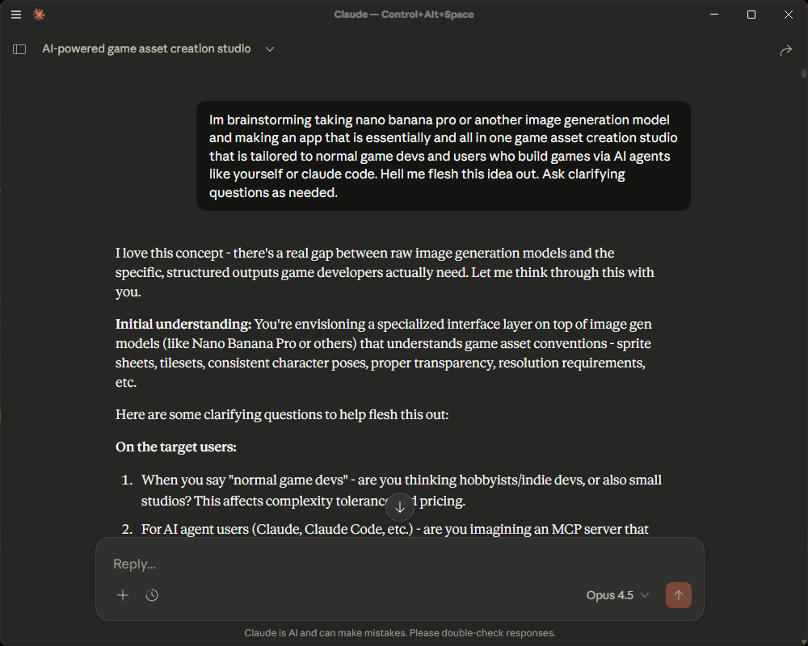

# Part 8: Completing the Cycle - Export Workflow

**Previously:** Hardened the API and secured the data layer. The generation engine is producing beautiful, consistent assets.

**Now:** We solve the final problem: getting those assets out of the app and into the user's game engine.

Building an AI generation tool is fun, but if the output is just a bunch of "Image_1.png", "Image_2.png" files in a browser library, it’s not a tool—it’s a toy. To make Asset Hatch a professional utility, we needed a robust export pipeline.

## The Strategy: Single-Asset Extraction ([ADR-014](https://github.com/zenchantlive/Asset-Hatch/blob/main/src/memory/adr/014-asset-extraction-strategy.md))

Early in the project, I considered generating "sheets" of assets. However, as documented in **ADR-014**, we pivoted to a **Single-Asset Generation Strategy**.

### Why Single-Asset?
1. **Precision:** Flux.2 handles a single subject far better than a complex grid of 16 items.
2. **Post-Processing:** It's easier to remove backgrounds and upscale individual objects.
3. **Semantic Control:** Each generation is tied to a specific requirement (e.g., "Main Character - Walk Cycle - Frame 1").

### The Prompt Engineering Fix
To prevent the "showroom" effect (where AI generates furniture in a room instead of a standalone sprite), we updated our templates with strict isolation keywords:

```typescript
// lib/prompt-templates.ts
export const buildCharacterSpritePrompt = (desc: string) => `
  ${desc}, 
  single isolated object, 
  centered on transparent background, 
  no other objects in scene, 
  professional game asset sprite...
`;
```

## Engineering the Export Pipeline

The export process happens in three stages:

### 1. Semantic ID Generation
We don't want `7b3f-2a1c.png`. We want `hero_knight_idle_01.png`. 
We implemented a semantic ID generator that pulls from the original request parameters to ensure the exported ZIP is immediately organized for the developer.

### 2. ZIP Packaging (Client-Side + API)
We built an export endpoint that aggregates all "Approved" assets for a project. 

```typescript
// app/api/export/route.ts
export async function POST(req: Request) {
  const { projectId, assetIds } = await req.json();
  const assets = await prisma.generatedAsset.findMany({
    where: { id: { in: assetIds }, projectId }
  });

  // Fetch blobs from Dexie (client side) or storage (server side)
  // Packaging them into a single archive...
}
```

### 3. ZIP Streaming
To handle large asset packs (20+ high-res pngs), we implemented a streaming ZIP download. This avoids memory spikes on the server and provides an "instant start" feel for the user.

## The UX: The Export Panel

The final piece of the UI puzzle was the `ExportPanel`. It’s a dedicated mode that:
- Summarizes the total asset count.
- Shows a preview of the ZIP structure.
- Provides a one-click "Download Package" button.



## What Completing the Loop Taught Me

**1. The "Last Mile" is the Hardest**
Generating an image takes 20 seconds. Building the infrastructure to name, package, and deliver that image takes 2 days. Don't underestimate the delivery layer.

**2. ADRs are Legal Records for Future You**
ADR-014 was critical. When I felt the urge to go back to sprite sheets, I re-read the trade-off analysis and realized why I chose single-assets. It kept the project on track.

**3. Tool Design is DX (Developer Experience)**
Asset Hatch is built for developers. Helping them by automatically naming files and organizing folders isn't "polish"—it's a core feature.

---

## Coming Next

In [Part 9: V2.1 - The UI Layer and The Split Brain](09-v2-1-ui-overhaul-chaos.md), we look at how a simple "UI tweak" turned into an architectural overhaul.

---

**Commit References:**
- `08dd2df` - Phase 1: Single-asset generation strategy
- `789ad0a` - Phase 2: Export format types and semantic ID generation
- `e630b94` - Phase 3: Export endpoint and UI for ZIP download
- `67e30f3` - Phase 4: Complete export workflow integration
- `c03eb39` - Final: Update ADR-014 and active state for completed system

**Files Modified:**
- `/app/api/export/route.ts` - ZIP generation logic
- `/components/export/ExportPanel.tsx` - The export UI
- `/lib/prompt-templates.ts` - Isolation keyword integration
- `/memory/adr/014-asset-extraction-strategy.md` - Strategy documentation

---

**Previous:** [← Part 7: Hardening](07-hardening-battle-testing-the-api.md)
**Next:** [Part 9: V2.1 - The UI Layer and The Split Brain →](09-v2-1-ui-overhaul-chaos.md)
